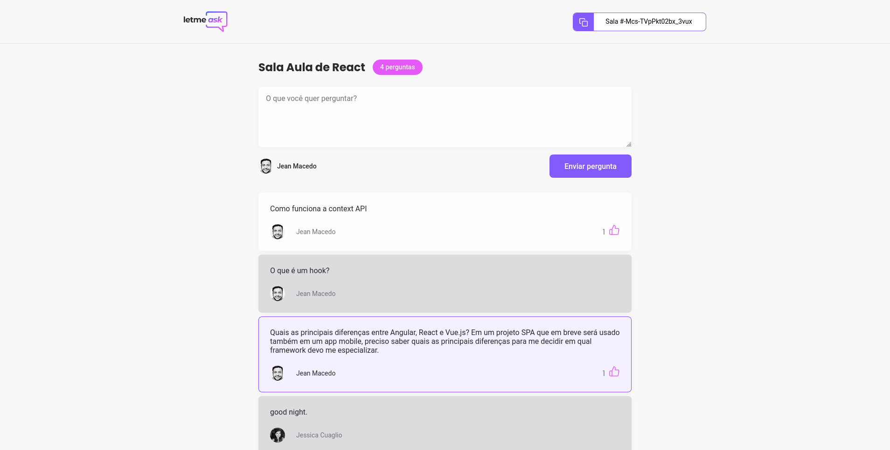

<div align="center">
  
</div>

## Let Me Ask

[](https://github.com/JFMacedo)
[](#)
[](https://github.com/JFmacedo/letmeask/stargazers)
[](https://letmeask-c5fd1.web.app)

<h4 align="center">
  Let Me Ask é uma plataforma para que criadores de conteúdo possam organizar as perguntas de sua audiência.
</h4>



## Tecnologias

Esse projeto foi desenvolvido com as seguintes tecnologias.


- [ReactJS](https://reactjs.org/)
- [Typescript](https://www.typescriptlang.org/)
- [Firebase Authentication](https://firebase.google.com/products/auth)
- [Firebase Realtime Database](https://firebase.google.com/products/realtime-database)

## 💻 Rodando o projeto

### Requirements

- Você precisa ter instalado o [Node.js](https://nodejs.org/en/download/) e o [Yarn](https://yarnpkg.com/) para rodar esse projeto.

**Clone o projeto e acesse o diretório**

```bash
$ git clone https://github.com/JFMacedo/letmeask.git && cd letmeask
```

**Siga as instruções**

```bash
# Instalar as dependências
$ yarn

# Lembre de configurar seu .env.local seguindo o .env.exemple

# Rode o servidor web
$ yarn start
```

O aplicativo será acessível no browser em `http://localhost:3000`

---

Desenvolvido por [Jean Fernandes de Macedo](https://github.com/jfmacedo91)

[](https://www.linkedin.com/in/jfmacedo91)
[](mailto:jfmacedo91@gmail.com)
